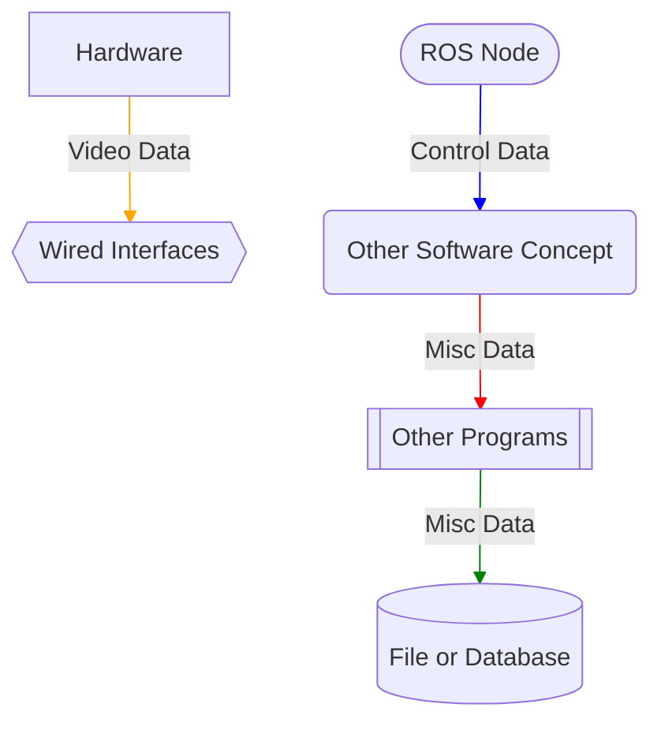
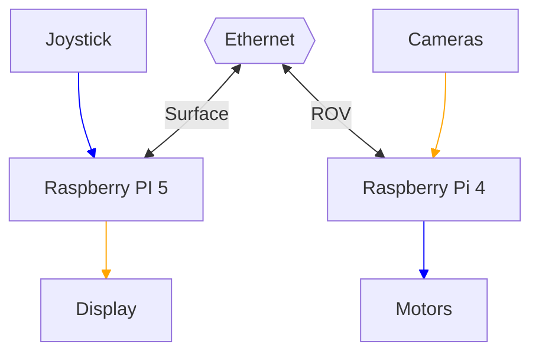
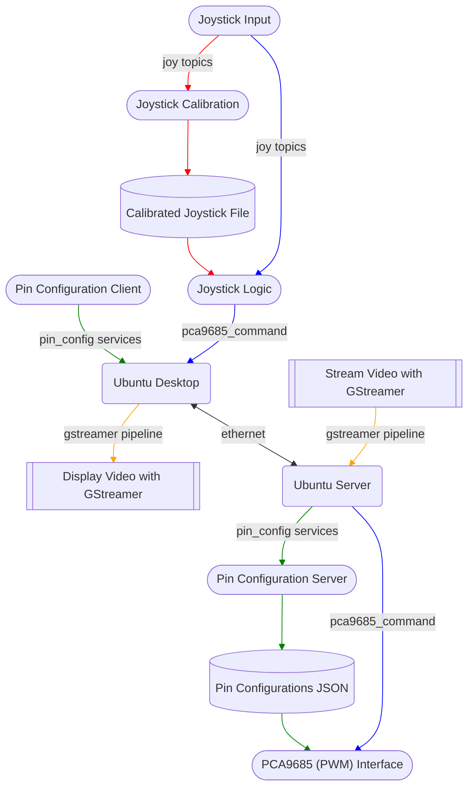

# SLVROV ROS 2 Stack

This is a system that uses ROS2 to control the ROV for SLVHS robotics (Sea Exploration League), and is run on a Raspberry Pi.
The system consists fo the following:
* joystick nodes (not created by us)
* joystick calibration node
* joystick logic node
* pca9685 (pwm hardware) node
* config nodes to edit motor definitions

Joystick Nodes --sensor_msgs/Joy--> Joystick Logic Nodes --slvrov_interfaces/PCA9685Command--> PCA9685/PWM Node --PWM signal (non-ROS2)--> Motors/Servos

### Graphs Key

## Harware System Abstract

### Surface
On the surface, a Raspberry Pi 5 is connected to a joystick(s) and a display. The Pi 5 is in charge of interpreting joystick input and passing it down to the ROV through ethernet. The surface Pi also recieves a camera feed and displays it.

### ROV
In the ROV, a Raspberry Pi 4 is connected to motors/servos as well as a camera(s). From the forwarded interpreted input, the Pi manipulates the motors. It also runs live video up to the surface.

## Software System Abstract

### Ubuntu Desktop (Surface/Raspberry Pi 5)
Ubuntu Desktop will be responsible for the joystick input, calibration, joystick logic, and pin configuration ROS2 nodes. Additionally, it will accept live video from the ROV using a GStreamer program.

#### Joysticks
Throughout operation, the joystick node will read and pubish input messages to a topic, e.g. "joy0". In some cases, there may be multiple joystick nodes if more than one joystick is being used. Before input can be interpreted and sent to the ROV, a file describing how joystick indices and axes map to each type of movement. This is best done once using the joystick calibration node. Once this is saved, the joystick logic node can interpret joystick input from the joystick topic and send it to the ROV.

#### Pin Configuration
The pin configuration client can be run to edit the physical pin map of software-defined pwm devices. Through a few services, a user could view existing configurations or add new ones. These will exist on a file on the ROV computer.

#### Gstreamer Streaming
For simple cases, a script located in slvrov-tools (slvrov_tools_vendor/slvrov-tools) called 'udp-cam' could be used to display a live udp stream from the ROV. For more complex cases, more verbose gstreamer commands can be used (e.g. using compositor to display multiple feeds at once).

### Ubuntu Server (ROV/Raspberry Pi 4)
...

## Testing

### 1. Log into Raspberry Pi with dependencies installed
   * ssh [usr]@[rpi-ip]
   * scp /path/to/slvrov_ros [usr]@[rpi-ip]

### 2. Follow build instructions for this repo

### 3. Baisc Testing
   * using ros2 topic pub to test subscriber nodes
   * using ros2 service req to test server nodes

### 4. Intermediate Testing
   Once the nodes have been tested by probing them with ros2 commands, run multiple nodes without peripherals to see if they interface correctly.
   Succes should be indicated, at the base level, by well-placed self.get_logger() calls.

### 5. Advanced Testing
   Attach needed peripherals to Raspberry Pi.
   Run multiple nodes with the necessary hardware.
   If any problems arise, use diagnostic tools like i2cdetect to see where the problem occurs, if not located in the code.

### 6. Editing/Updating Code
   If any changes in the code need to be made, make sure to rebuild the ros2 package that changed.
   Run 'colcon build --packages-select [package names]'
