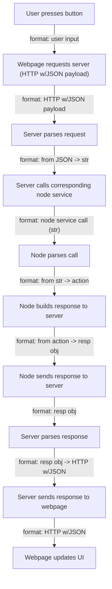

# Requests Based on Joystick Mapper Services

## Flow
This is the current flow. However, I will change node interactions with the server in the future, so only worry about what the webpage is doing.


## Requests

### Activation Service
#### __POST /joystick_mapper/set_mapper_state__
```json
{
    setMapperState: "active" | "inactive"
    topics: ["/js0,/js1"] | []
}
```
This is the req the webpage send the server.
If setMapperState is "inactive", the topics field is left empty.
This will be called on a press of an "Activate" button.


#### Server response (for both deactivation and activation)
```json
{
    success: False
    message: "Requested topics don't exist"
}
```
I think I'll make it so the server only sends this json if there's a failure.
Instead, I'll have it update the status.
Error msg can have up to 50 characters.

### Set Action Server
#### __POST /joystick_mapper/set_action__
```json
{
    action_name: "myAction"
    action_type: "js_button"
}
```
This is the req the webpage will make to set the current action of the mapper.
This will be called on the action wizard "Map Action Now" button and the queue's "Map Action Next" button.

#### Server response 
```json
{
    success: False
    error: "Server side error"
}
```
I think I'll make it so the server only sends this json if there's a failure.
Instead, I'll have it update the status.
Error msg can have up to 50 characters.

### Toggle Mapping Service
#### __POST /joystick_mapper/set_mapping_state__
```json
{
    setMappingState: "active" | "inactive"
}
```
This is the req the webpage will make to start/stop the mapping process.
This will be called by a button somewhere that says "Start Mapping Current Action" (or similar), which then switches text to say "Stop Mapping Current Action".

#### Server response 
```json
{
    success: False
    error: "Server side error"
}
```
I think I'll make it so the server only sends this json if there's a failure.
Instead, I'll have it update the status.
Error msg can have up to 50 characters.

### Mapper Status Service
#### __GET /joystick_mapper/status__

This will be called by the refresh status button from the status bar.
Yes. A GET request can be sent with no payload/body here, and that is the simplest choice for this status route.

#### Server response 
```json
{
    success: True
    isMapperActive: True | False
    subscribedTopics: ["/js0", "/js1", "/js2"] | []
    isMappingActive: False | True
    currentAction: None | "myAction/js_button"
    saveState: "unsaved" | "saved"
}
```
This will be the response when the user requests a state chnage of the mapper or status update.
If the state change is successful, the server will send this, else an error message.
Character limit on currentAction is 50 characters.
