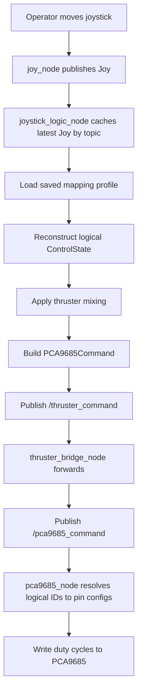

# Control Flow

This document traces the current control flow from operator input to PCA9685
hardware output.

## End-To-End Flow

## Safety Branches

If joystick topics go stale:

- the logic node drops stale messages
- control returns to neutral

If calibration is incomplete:

- unmapped actions stay neutral
- warnings are logged
- mapped actions continue working

## File and Logic Relationship

- calibration determines the binding file
- the logic node owns interpretation and safety handling
- the bridge only routes messages
- the PCA9685 node owns hardware translation

## Deferred Paths

Not active yet, but reserved in comments and docs:

- button fallback arbitration before mixing
- text control feeding the same `ControlState`
- expanded YAML profile metadata
- claw control reintroduction through a future contract

## Rationale

- The control path is kept linear and easy to inspect so failures are easier to
  isolate.
- Safety handling lives in the joystick logic node because that is the first
  layer that understands the meaning of actions like `forward` or `yaw`.
- Redundancy features are deferred until they can reuse this same flow instead
  of creating parallel control pipelines with different safety behavior.
