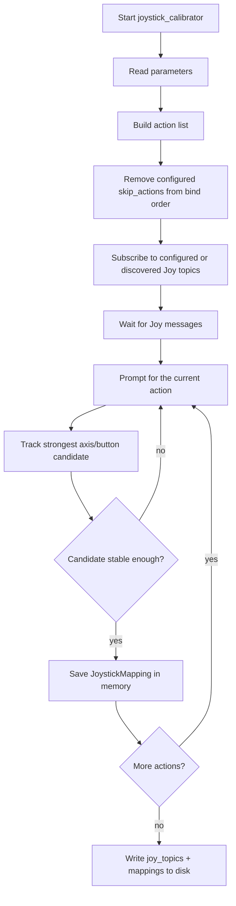

# Joystick Calibration

This document explains the node implemented in
`/src/slvrov_nodes_python/slvrov_nodes_python/joystick_calibrator.py`.

## Purpose

The joystick calibrator discovers which joystick topic and axis/button should be
used for each logical ROV action, then saves that result to disk.

It supports:

- one or multiple joystick topics
- axis or button bindings
- skipping actions during calibration
- saving the resulting mapping file for reuse

## Flow



## Skipped Actions

There are two ways actions can be skipped today:

- preconfigured skip list through `skip_actions`
- operator-entered `skip` command during calibration

Both are now logged clearly. The current on-disk YAML stays unchanged and only
stores:

- `joy_topics`
- `mappings`

Skipped actions are not persisted yet. Deferred profile ideas now live in
`/src/slvrov_nodes_python/slvrov_nodes_python/unimplemented_features.py`
instead of inside the active node file.

## Saved File Shape

The calibrator still writes the existing simple shape:

```yaml
joy_topics:
  - /joy_left
  - /joy_right
mappings:
  - action: forward
    topic: /joy_left
    source: axis
    index: 1
    invert: true
    deadzone: 0.1
    scale: 1.0
```

## Operator Commands

While calibration is running:

- `skip`: skip the current action
- `undo`: remove the last saved mapping
- `quit`: save progress and exit

## Deferred Work

Planned but intentionally not enabled in this pass:

- persisting `skipped_actions`
- multiple bindings per logical action
- button-fallback metadata
- claw calibration support

## Rationale

- The file shape is kept stable so existing logic-node loading and operator
  habits continue to work.
- Skipped actions are logged now even though they are not yet persisted, because
  the safety behavior in the logic node already benefits from better operator
  visibility.
- Future YAML edits are deferred because changing the profile format before the
  arbitration logic exists would create a half-finished contract.
- Claw actions were removed from the active calibrator so the live calibration
  flow only covers implemented vehicle controls.
