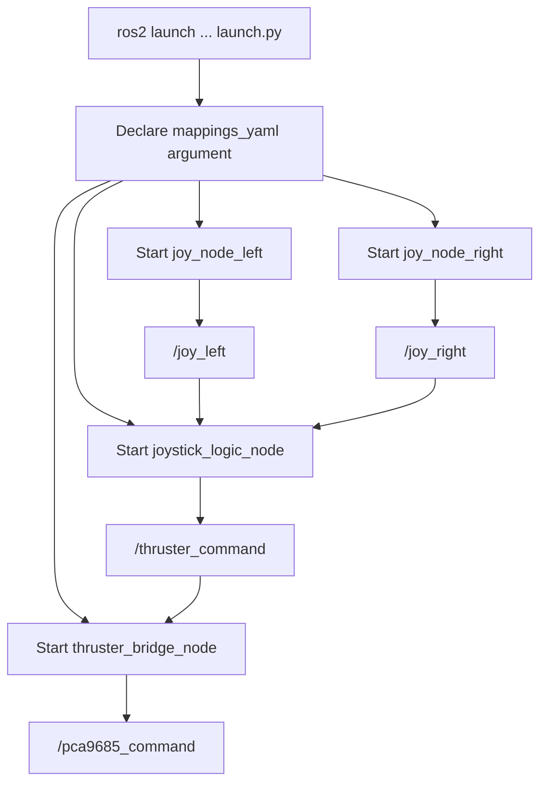

# Joystick Launch Stack

This document explains the launch file at
`/src/slvrov_nodes_python/launch/launch.py`.

## Purpose

The launch file starts the full joystick-to-thruster routing pipeline in one
command.

The recent change adds a single launch description that brings up:

- `joy_node_left`
- `joy_node_right`
- `joystick_logic_node`
- `thruster_bridge_node`

It also declares a launch argument for the joystick mapping file so the logic
node can load the saved calibration output.

## Launch Flow



## Node Roles

### `joy_node_left`

- Runs the ROS `joy` package driver
- remaps `/joy` to `/joy_left`
- uses the shared config YAML passed in `parameters=[cfg]`

### `joy_node_right`

- Runs a second joystick driver instance
- remaps `/joy` to `/joy_right`

### `joystick_logic_node`

- reads calibrated mappings
- subscribes to the left and right joystick topics
- converts logical controls into normalized thruster and claw commands
- publishes a `PCA9685Command` on `/thruster_command`

### `thruster_bridge_node`

- subscribes to `/thruster_command`
- republishes the same message on `/pca9685_command`

## Usage

Example:

```bash
ros2 launch slvrov_nodes_python launch.py \
  mappings_yaml:=/absolute/path/to/joy_mappings.yaml
```

## Parameters and Assumptions

- `mappings_yaml` defaults to `joy_mappings.yaml` under the package share
  config directory.
- `slvrov_config.yaml` is expected to live in the same package share config
  directory.
- The launch file assumes two joystick devices are available and should always
  be started together.

## Why This Launch File Helps

- It makes the joystick pipeline reproducible.
- It standardizes the `/joy_left` and `/joy_right` topic names.
- It ensures the bridge node is started alongside the joystick logic node.
