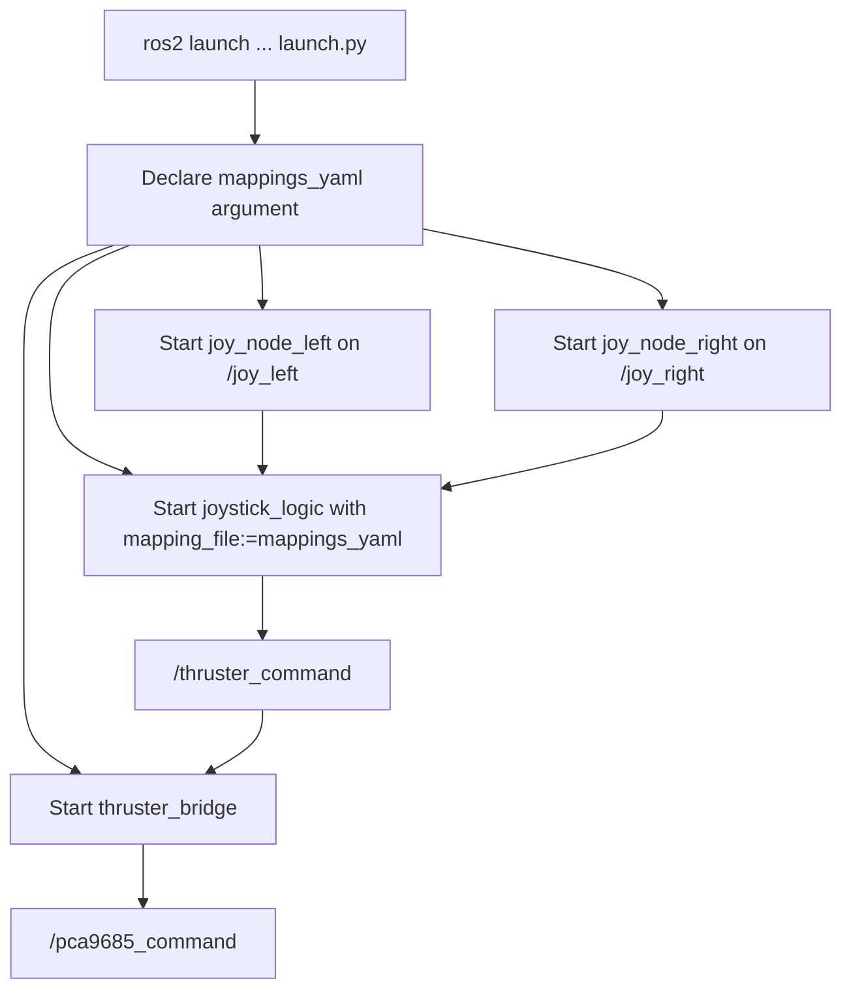

# Joystick Launch Stack

This document explains the launch file at
`/src/slvrov_nodes_python/launch/launch.py`.

## Purpose

The launch file starts the current joystick control path with minimal
assumptions:

- `joy_node_left`
- `joy_node_right`
- `joystick_logic_node`
- `thruster_bridge_node`

## Current Launch Behavior

The launch file now:

- uses the real console script name `joystick_logic`
- passes the mapping file path through the `mapping_file` parameter
- avoids depending on a package-share `config/` directory that is not present
  in this repository
- keeps the current two-controller topology as the least disruptive setup

## Launch Flow

## Parameters

- `mappings_yaml`: defaults to `joy_mappings.yaml` in the current working
  directory when launch is started

## Deferred Hooks

Deferred runtime ideas are tracked in
`/src/slvrov_nodes_python/slvrov_nodes_python/unimplemented_features.py`.

## Rationale

- `mapping_file` is passed explicitly because the calibration output is
  application data, not a ROS parameter file with a guaranteed namespaced
  structure.
- The old config-directory assumption was removed because launch should match
  the repository as it exists, not an expected future package layout.
- The two-joystick shape remains for now because it matches the current control
  workflow and keeps this pass focused on safety fixes rather than topology
  redesign.
- Deferred nodes are not listed inline in the launch file because the active
  launch surface should only describe runnable components.
