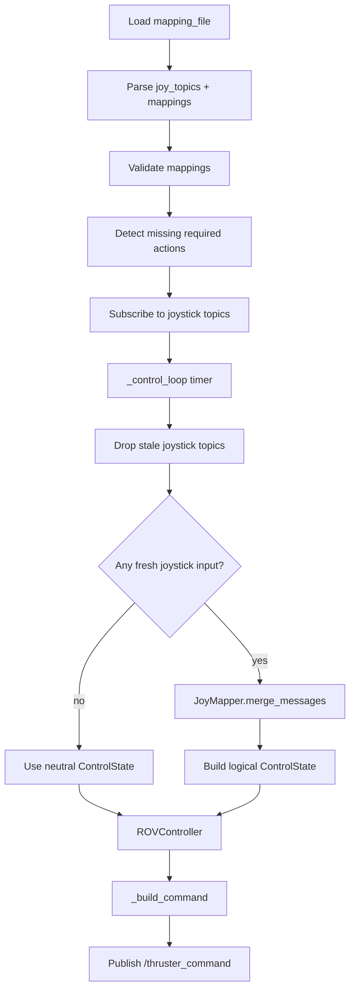

# Joystick Logic Node

This document explains the node implemented in
`/src/slvrov_nodes_python/slvrov_nodes_python/multi_joy_logic.py`.

## Purpose

The joystick logic node is the control translator between saved calibration
data, live `Joy` messages, and downstream thruster commands.

It:

- loads the saved joystick mapping file
- subscribes to one or more joystick topics
- reconstructs the logical vehicle control state
- keeps unmapped actions neutral-safe instead of failing startup
- publishes normalized thruster commands on `/thruster_command`

## Current Structure

Key pieces in the module:

- `JoystickMapping`: one saved binding from one physical control to one logical
  action
- `ControlState`: normalized logical control values for movement
- `JoyMapper`: reads current `Joy` messages and applies deadzone, invert, and
  scaling
- `ROVController`: applies the movement mixer
- `JoystickLogicNode`: owns parameters, subscriptions, warnings, and the timer
  loop

## Runtime Flow



## Missing and Skipped Actions

The node now distinguishes between required actions that are active in the
runtime and deferred actions that are ignored.

If an action is not present in the loaded mappings:

- startup continues
- the missing action is logged
- that action stays neutral in the `ControlState`
- the mixer and downstream command contract stay unchanged

This means a partially calibrated profile does not cause stale or undefined
movement. Missing controls simply do nothing until they are mapped.

## Deferred Work

Deferred feature details now live in
`/src/slvrov_nodes_python/slvrov_nodes_python/unimplemented_features.py`.

## Usage

Example:

```bash
ros2 run slvrov_nodes_python joystick_logic --ros-args \
  -p mapping_file:=/absolute/path/to/joy_mappings.yaml
```

## Rationale

- Missing/skipped actions stay neutral instead of blocking startup because a
  partially calibrated system is safer when it produces no command for unknown
  controls.
- The mapping file is passed explicitly and loaded by the node because the file
  is application data, not a ROS parameter file with a fixed node namespace
  shape.
- Button fallback is deferred because enabling it correctly requires a new
  multi-binding mapping schema and arbitration rules.
- Text redundancy is deferred because it should feed the same logical control
  state instead of creating a second mixer path.
- Claw support was removed from the active joystick logic path so the runtime
  behavior stays narrow, predictable, and easier to maintain while the deferred
  design is still unsettled.
