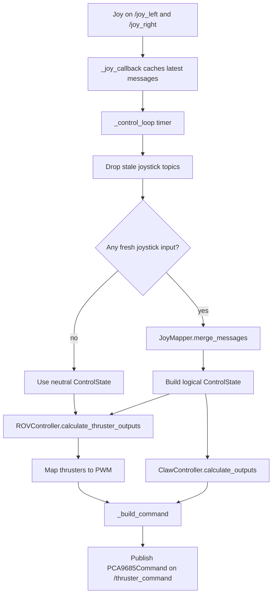

# Joystick Logic Node

This document explains the node implemented in
`/src/slvrov_nodes_python/slvrov_nodes_python/multi_joy_logic.py`.

## Purpose

The joystick logic node is the control translator between raw joystick input
and the actuator command pipeline.

It:

- subscribes to one or more `sensor_msgs/msg/Joy` topics
- applies calibrated mappings to recover logical vehicle controls
- mixes those logical controls into thruster outputs
- converts claw controls into servo-style outputs
- publishes the combined result as a `slvrov_interfaces/msg/PCA9685Command`
  on `/thruster_command`

The recent change adds the command publisher and `_build_command()` helper so
the node now emits a single message for downstream routing.

## End-To-End Flow



## Main Components

### `JoystickMapping`

Defines how one physical axis or button maps onto one logical action.

### `ControlState`

Stores the normalized logical control values used by the vehicle mixer and claw
controller.

### `JoyMapper`

Reads the latest `Joy` messages and converts them into one merged logical
control state.

Key jobs:

- safe axis and button access
- deadzone handling
- scaling and inversion
- merging multiple joystick topics into one logical state

### `ROVController`

Turns the logical vehicle controls into per-thruster values using:

- `axis_gains`
- `mixing_matrix`
- `thruster_inversions`

It also scales outputs back if any thruster would saturate above `1.0`.

### `ClawController`

Maps normalized claw commands to PWM-centered output values for:

- `claw`
- `rotate`
- `tilt`

### `JoystickLogicNode`

Owns parameters, subscriptions, publishers, and the periodic control loop.

## Runtime Flow

1. The node loads joystick topics and mappings from parameters or a mapping
   file.
2. It validates the mapping definitions.
3. It subscribes to every configured joystick topic.
4. A timer runs `_control_loop()` at `loop_rate_hz`.
5. Stale joystick topics are ignored using `joy_timeout_sec`.
6. The current logical `ControlState` is built from fresh joystick messages.
7. The vehicle controls are mixed into thruster commands.
8. The claw controls are converted into claw PWM targets.
9. `_build_command()` converts those outputs into normalized values and labels
   them as `thruster_1`, `thruster_2`, and so on plus `claw`, `rotate`, and
   `tilt`.
10. The node publishes one `PCA9685Command` on `/thruster_command`.

## Key Topics

- Subscribes: configured joystick topics such as `/joy_left` and `/joy_right`
- Publishes: `/thruster_command`

## Usage

Manual example:

```bash
ros2 run slvrov_nodes_python joystick_logic --ros-args \
  -p mapping_file:=/absolute/path/to/joy_mappings.yaml \
  -p joy_topics:="[/joy_left,/joy_right]"
```

In normal operation this node is expected to run as part of the launch stack.

## Why This Design Works

- The joystick mapping logic is isolated from hardware pin routing.
- Multiple joystick topics can be treated as one logical operator interface.
- Topic timeouts fail safe to neutral instead of reusing stale commands.
- The downstream bridge and PCA9685 node receive one consistent command type.
