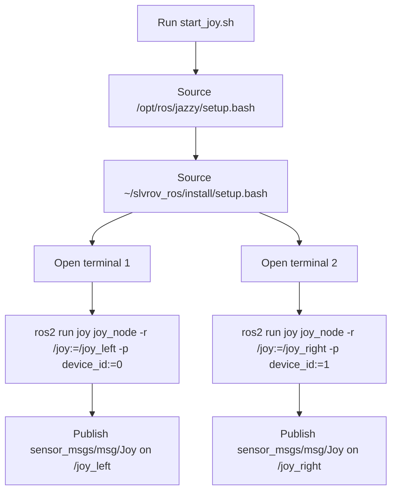

# start_joy.sh

This document explains the helper script at `/start_joy.sh` and how it fits
into the joystick pipeline.

## Purpose

`start_joy.sh` is a convenience launcher for the two physical controllers used
by the ROV operator station.

Instead of starting two `joy_node` processes by hand, it:

- sources ROS 2 Jazzy
- sources the local workspace overlay
- opens one terminal for the left controller
- opens one terminal for the right controller
- remaps the default `/joy` topic into separate topics for each device

The recent change introduces the left/right split explicitly:

- device `0` publishes on `/joy_left`
- device `1` publishes on `/joy_right`

## Flow



## Function

The script does not process joystick data itself. Its only job is to ensure
that two joystick drivers are running with predictable topic names so the rest
of the control stack can subscribe to them.

That separation matters because:

- the calibrator can bind controls from multiple topics
- the joystick logic node can merge left and right controller input
- the launch flow can assume stable topic names

## Usage

Run:

```bash
./start_joy.sh
```

Expected result:

- one terminal starts a `joy_node` for `/joy_left`
- one terminal starts a `joy_node` for `/joy_right`

## Notes

- The script assumes `gnome-terminal` is available.
- It assumes the workspace has already been built and installed.
- It assumes Linux joystick device ordering is stable enough that device `0`
  is the intended left controller and device `1` is the intended right
  controller.
