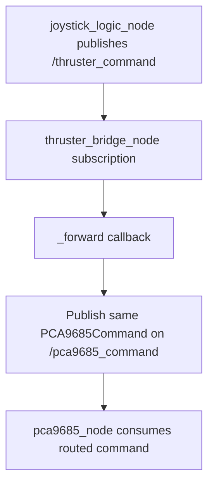

# Thruster Bridge Node

This document explains the node at
`/src/slvrov_nodes_python/slvrov_nodes_python/thruster_bridge_node.py`.

## Purpose

`thruster_bridge_node` is a thin routing node between joystick control logic
and the PCA9685 hardware interface.

The recent change introduces this node so:

- `multi_joy_logic.py` can publish a generic command on `/thruster_command`
- the PCA9685 side can keep listening on `/pca9685_command`
- topic routing can change without rewriting either side of the pipeline

## Flow



## Function

The node has only one operational responsibility:

- receive a `slvrov_interfaces/msg/PCA9685Command`
- publish the same message unchanged on a different topic

There is no remapping of IDs, scaling, PWM conversion, or pin lookup in this
node. It is intentionally simple.

## Topics

- Subscribes: `/thruster_command`
- Publishes: `/pca9685_command`

## Usage

Manual example:

```bash
ros2 run slvrov_nodes_python thruster_bridge
```

Once running, the node logs that it is forwarding:

- `/thruster_command`
- `/pca9685_command`

## Why Keep It Separate

- It preserves a clean boundary between control logic and hardware routing.
- It makes topic migration easy.
- It keeps the bridge behavior easy to inspect and low risk to change.
